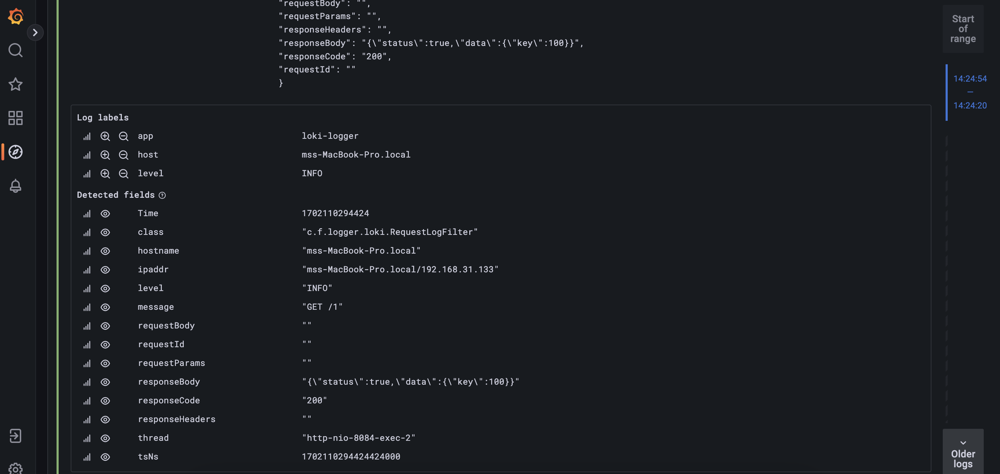

# Spring Boot with Grafana-Promtail-Loki Stack [GPL]
In recent days, developers are mostly familier with the ELK stack that stands for Elasticsearch, Logstash and Kibana.

Here I have implemented GPL stack which is very similar with the ELK stack, let me help you get aligned.

## Side by Side Stacks

| ELK           | GPL      | Purpose                                 |
|---------------|----------|-----------------------------------------|
| Kibana        | Grafana  | For query and view                      |
| Logstash      | Promtail | Reading the logs and push to aggregator |
| Elasticsearch | Loki     | Preserving logs and indexing            |

## Grafana View after implementing it with Spring Boot

## Reasons for choosing GPL stack
Here are few pros and cons of using the mentioned stack here:

### Pros

- GPL stack is less memory hungry as like ELK
- Grafana is very old player in logging, hence it provides out of the box labelling for logs
- Very lightweight logger can fit into any application without any issue
- Making cluster with loki is very simple and can load balance internally
- It only indexes the labels, hence takes less time to insert

### Cons

- If loki configuration is not proper, you may end up having old logs with recent timestamp.
- Don't support fulltext search
- Do not support aggregate functions, hence making report from the logs is difficult.
- Do not provide any relevancy score like ELK which helps to understand accuracy

# Thanks for checking it out.